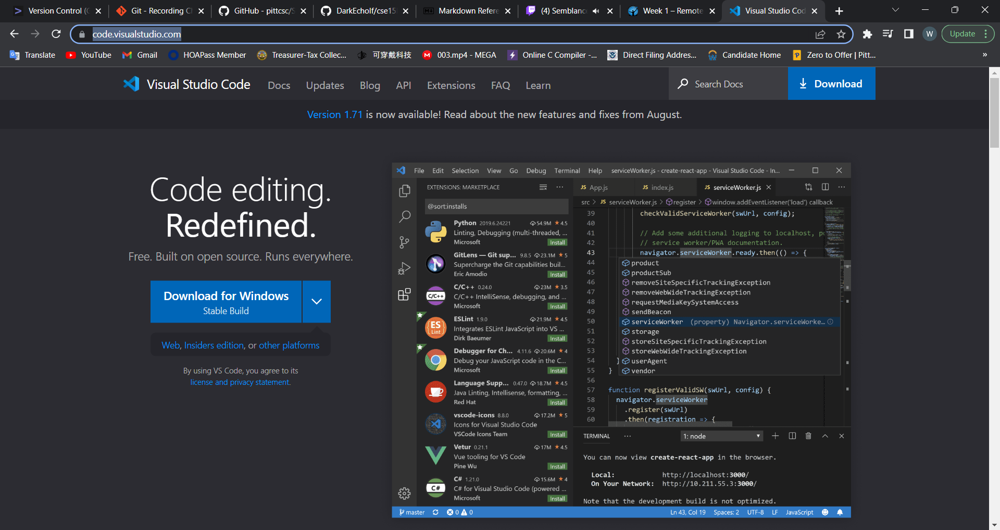
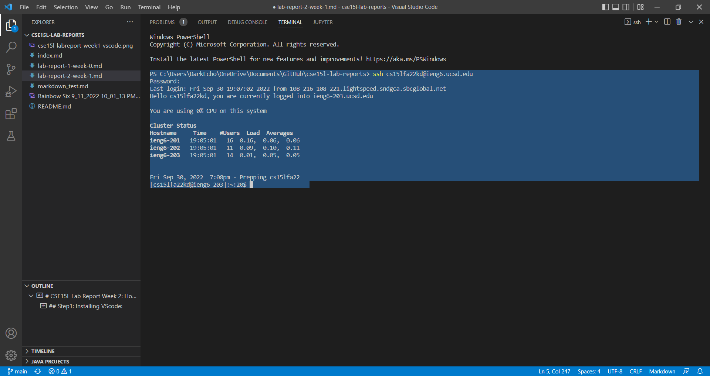
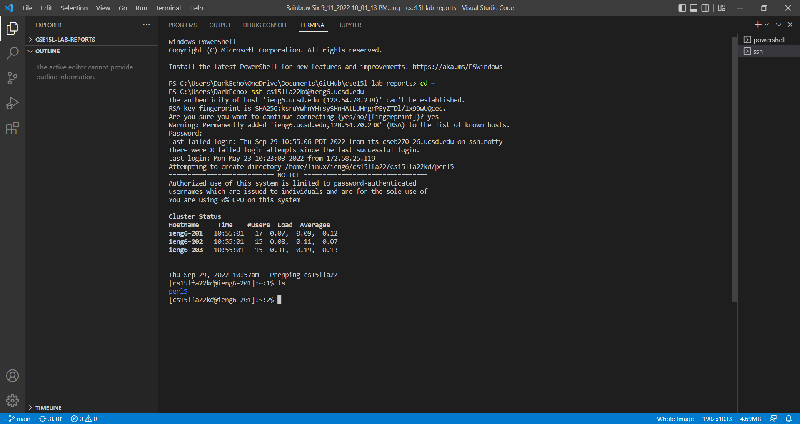
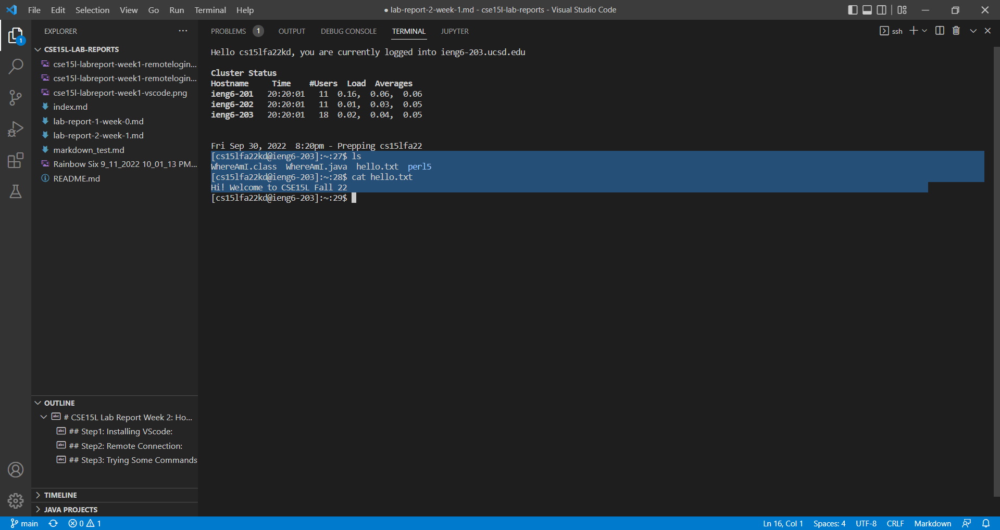

# CSE15L Lab Report Week 2: How to ssh(and other stuff)!
## Step1: Installing VScode:
Okay, even though I did use VScode to login to my ieng6 account and I am using it right now to edit the Markdown file you are reading, I still don't get why Joe want us to include this step. What we essentially need is the Terminal, right? Anyway, let us dive into this.

First, go to the website highlighted in the picture above. Then, get the version of VScode that works on your OS. Mine is just Windows, so I click "Download for Windows". More choices will show up if you click the pointing down icon on the right.
## Step2: Remote Connection:

In this step, we will access a remote account(usually on another server) from the client(usually your device). We open a new Terminal in VScode(Terminal -> New Terminal). Now we focus on the highlighted texts. We type the command: ssh cs15fa22**@ieng6.ucsd.edu, then press enter. Notice that you should replace ** with two alphabets specifically assigned to your account. You should see similar messages shown below the command line. Good work, you are now in your ieng6 account.

......

Ha, you thought that was easy? Actually, since you are most likely doing this for the first time. After you enter the ssh command, you will see some message just like in the picture. Long story short, just like every Term of service you see in your life, you say 'yes' to it; it's also normal to see it the first time you ssh to this account. However, if you have doubts, Professor Poiltz shared this, I will put it here for your information: [Ben Voigt's answer](http://a.com).

## Step3: Trying Some Commands

I am going to demonstrate two commands that are more used and applicable to the current directory.

**ls**

'ls' stands for list and it will show you the contents of the current directory.

**cat <name_of_file>**

'cat' stands for concatenate and it will print out contents in the file you choose. For instance, I entered 'cat hello.txt' which returns to me the exact texts in the 'hello.txt' file.
## Step4: Moving Files with scp
