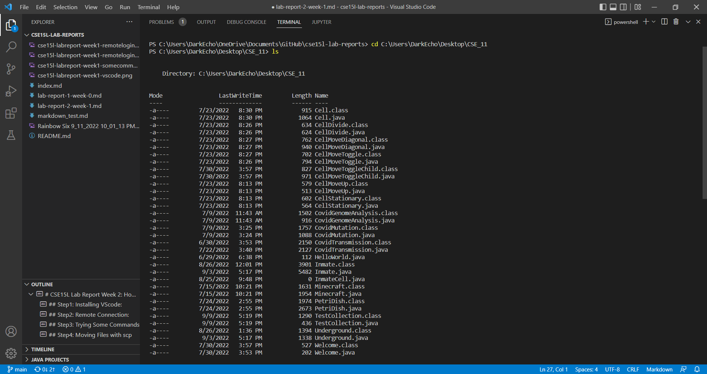
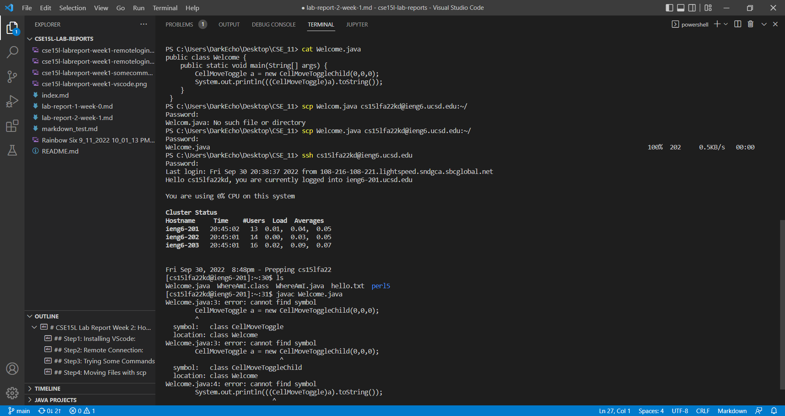
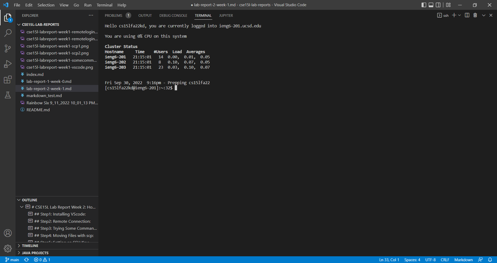
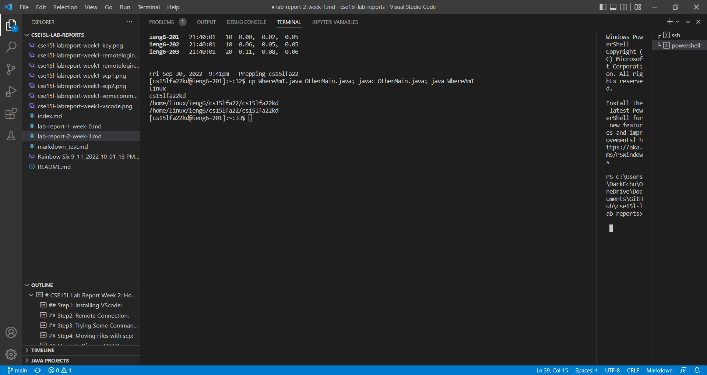

# CSE15L Lab Report Week 2: How to ssh(and other stuff)!
## Step1: Installing VScode:
Okay, even though I did use VScode to login to my ieng6 account and I am using it right now to edit the Markdown file you are reading, I still don't get why Joe want us to include this step. What we essentially need is the Terminal, right? Anyway, let us dive into this.

First, go to the website highlighted in the picture above. Then, get the version of VScode that works on your OS. Mine is just Windows, so I click "Download for Windows". More choices will show up if you click the pointing down icon on the right.
## Step2: Remote Connection:

In this step, we will access a remote account(usually on another server) from the client(usually your device). We open a new Terminal in VScode(Terminal -> New Terminal). Now we focus on the highlighted texts. We type the command: ssh cs15fa22**@ieng6.ucsd.edu, then press enter. Notice that you should replace ** with two alphabets specifically assigned to your account. You should see similar messages shown below the command line. Good work, you are now in your ieng6 account.

......

Ha, you thought that was easy? Actually, since you are most likely doing this for the first time. After you enter the ssh command, you will see some message just like in the picture. Long story short, just like every Term of service you see in your life, you say 'yes' to it; it's also normal to see it the first time you ssh to this account. However, if you have doubts, Professor Poiltz shared this, I will put it here for your information: [Ben Voigt's answer](http://a.com).

## Step3: Trying Some Commands:

I am going to demonstrate two commands that are more used and applicable to the current directory.

**ls**

'ls' stands for list and it will show you the contents of the current directory.

**cat <name_of_file>**

'cat' stands for concatenate and it will print out contents in the file you choose. For instance, I entered 'cat hello.txt' which returns to me the exact texts in the 'hello.txt' file.
## Step4: Moving Files with scp:

In the first picture, I first 'cd' to access my CSE11 directory. 'ls' shows me what are in the folder, there are a lot of files, already compiled. I will move 'welcome.java' to the remote account.

As it is shown in the second screenshot, we run the command 'scp Welcome.java cs15lfa22kd@ieng6.ucsd.edu:~/'. The command is composed by three parts: scp, the file you want to move, and the account/directory you want the file to be. We will need to enter the password to complete the moving, but it does not login to the account, hence we login again to check if the file we want is there. Using 'ls' again, we find there is indeed a 'Welcome.java' in the folder, which wasn't in it before. Mission Compelte.(And I totally failed to compile it, since the file refers to some class that the remote account does not include.)
## Step5: Setting an SSH Key:
Here is something that will make life easier: Using ssh keys to generate a pair of public and private keys that will save you from entering passwords everytime you login to your ieng6 account.

Sorry, I was not able to get an ideal screenshot for this because we can only set this up once, I made mistakes and did not record my first attempt. However, I will do my best to let you, and future me, to understand the process.

First, on client, we need to run 'ssh-keygen' to start the process. Then, the terminal will ask you for the location to save the key and create a passphrase. This part I failed to record. Nontheless, unless you are super sensetive for privacy and want to be extra confident with the security of the key, for this step you can just press 'enter' three times. A .pub file which is your 'public key' will be created and you need to copy for later use.

Next, we login to the ieng6 account. On server, we run 'mkdir .ssh', and logout. Finally, on client, you enter 'scp <.pub file you copied> <'your user account'>:~/.ssh/authorized_keys'. The terminal will ask you to enter password. After that, when you try to ssh to ieng6 again, you won't need to enter password no more!
## Step6: Optimizing Remote Running:
Last but not least, I have some more tricks that will make your ssh experience more pleasant.

* Try 'ssh cs15lfa22@ieng6.ucsd.edu "ls"'. This will allow you to login while run some command that you might want to give after the successful login. See the outcome of the code above. I have also tried, 'ssh cs15lfa22@ieng6.ucsd.edu "cat WhereAmI.java"', what is the result?
* You can also use ';' as the separator to run multiple lines of commands in one line. I personally have a neutral opinion about this operation: it can make sense in some situations for sure, but it also adds difficult to read the command later for me at least. Who knows? It never hurt to learn new skills.

